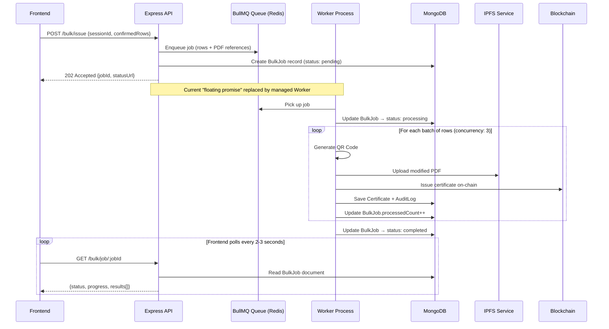

# Future Work: Robust Async Bulk Issuance with BullMQ

## The Problem

The current `POST /bulk/issue` implementation uses a **naive backgrounding** approach:
- **In-memory Volatility**: Job progress is stored in a `Map` (`bulkJobCache.js`). If the server restarts, all running jobs and their results are lost.
- **Floating Promises**: It uses an unmanaged `(async () => { ... })()` block. This can lead to unhandled rejections if not carefully managed and provides no way to limit concurrency across multiple users.
- **Single Process**: All processing happens on the main Express event loop, which could impact API responsiveness under heavy load.
- **No Persistence**: There is no database record of the "Job" itself, only the resulting certificates.

## The Plan

Upgrade the background processing from the current naive `Map` based system to a robust job queue using [BullMQ](https://docs.bullmq.io/) + Redis. This will provide persistence, retries, and the ability to scale processing to separate worker nodes.

## Architecture Evolution



## API Alignment

The current endpoints are already structured for this transition:

### `POST /bulk/issue` — Status: Partially Implemented
Currently returns `202 Accepted` and starts an in-memory job.
*To do: Switch from `bulkJobCache.create()` to `bullmq.add()`.*

### `GET /bulk/job/:jobId` — Status: Partially Implemented
Currently reads from `bulkJobCache`.
*To do: Switch to reading from MongoDB `BulkJob` model or BullMQ job state.*

## Files to Add / Modify

| File | Purpose | Status |
|------|---------|--------|
| `src/config/queue.js` | Redis + BullMQ queue setup | To be added |
| `src/models/bulkJob.model.js` | MongoDB model for persistent job tracking | To be added |
| `src/services/bulkQueue.producer.js` | Enqueues jobs | To be added |
| `src/workers/bulkIssuance.worker.js` | Processes rows in background | To be added |
| `src/services/bulkJobCache.js` | Current in-memory store | To be deprecated |

## New Dependencies

```bash
npm install bullmq ioredis
```

```env
REDIS_HOST=localhost
REDIS_PORT=6379
BULK_WORKER_CONCURRENCY=3
```

---

*This plan represents the transition from the current "MVP backgrounding" to a production-grade distributed job system.*

